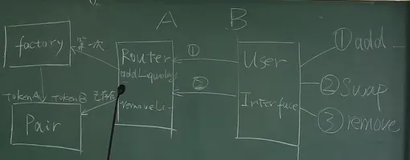

# DEX

## AMM（Automated Market Maker）

- Market Maker**（控制币对的交易价格比较平滑，避免出现价格从2美元突然降到1美元）**
- Liquidity
- Liquidity Provider

## 去中心化交易所核心要素

- 任何人都可以添加流动性，成为 LP，并拿到 LP Token
- LP 在任意时间可以移除流动性并销毁 LP Token，拿回自己的 Token
- 用户可以基于交易池来进行交易
- 交易时收取一定手续费，并且分配给 LP

## Constant Product Automated Market Maker（CPAMM，恒定乘积自动做市商）

- 添加流动性：注入流动性/初始价格确定
- 交易：$x*y=(x+\Delta x)*(y-\Delta y)=k$，滑点
- 移除流动性：无偿损失等

**这里我们要注意，swap 的时候会出现滑点，而在添加/移除流动性时则会出现无常损失，要区分好**

## 公式推演

$x*y=k$，$(x+\Delta x)*(y+\Delta y)=k$，知$\Delta x$，求$\Delta y$

1. 交换

$$
\begin{aligned}
x*y &=(x + \Delta x) * (y - \Delta y) \\
&= x*y + \Delta x * y - x *  \Delta y - \Delta x * \Delta y
\end{aligned}
$$

由上面可得，

$$
x*\Delta y + \Delta x*\Delta y = \Delta x * y 
\Rightarrow 
\Delta y = \frac{\Delta x * y}{x + \Delta x}
$$

1. 添加流动性

$$
\frac{x}{y} = \frac{x+\Delta x}{y+\Delta y}
$$

由上面可得，

$$
x*y + x*\Delta y = x*y + \Delta x*y 
\Rightarrow 
\Delta y = \frac{\Delta x*y}{x}
\Rightarrow
\frac{\Delta x}{\Delta y} = \frac{x}{y}
$$

- 为什么在 $x*y=k$中，$k$ 实际取 $k = \sqrt{x * y}$，而不是取 $x * y$?

这里是因为想要让 k 与流动性保持一种线性的关系，而不是像 $y = x ^ 2$ 在后面随着 x 的增加，y 的数值会急剧增加

$L_0$：添加之前的 Liquidity，设为 T

$L_1$：添加之后的 Liquidity，设为 T+S，其中 S 为添加的流动性

$$
\frac{L_0}{L_1} = \frac{T}{T+S}
$$

由上面可得，

$$
\begin{aligned}
S &= \frac{(L_1-L_0)*T}{L_0} \\
  &= \frac{\sqrt{(x + \Delta x)*(y + \Delta y)} - \sqrt{x*y}}{\sqrt{x*y}} * T \\
  &= \frac{\sqrt{(x + \Delta x)*(y + \frac{\Delta x * y}{x})} - \sqrt{x*y}}{\sqrt{x*y}} * \frac{\sqrt{x}}{\sqrt{x}} * T \\
  &= \frac{\sqrt{x^2 * y + \Delta x *x*y + \Delta x *x*y + \Delta x^2 *y} - x * \sqrt{y}}{x * \sqrt{y}} (消掉\sqrt{y})\\
  &= \frac{\sqrt{x^2 + 2*\Delta x*x + \Delta x^2} - x}{x} \\
  &= \frac{(x + \Delta x) - x}{x} \\
  &= \frac{\Delta x}{x} * T = \frac{\Delta y}{y} * T(同理)
\end{aligned}
$$

1. 移除流动性

S ：share的数量  T：移除流动性之前 Liquidity 的总量  L：Liquidity 的数量

$$
\begin{aligned}
&\frac{\sqrt{\Delta x * \Delta y}}{\sqrt{x*y}}=\frac{S}{T} \\
&\sqrt{\Delta x * \Delta y} = \sqrt{x*y} * \frac{S}{T} \\
&\Delta x * \sqrt{\frac{y}{x}} = \sqrt{x*y} * \frac{S}{T}(消掉\sqrt{y}，并把\sqrt{x}化简) \\
&\Delta x = x * \frac{S}{T} \\
&\Delta y = y * \frac{S}{T}(同理)
\end{aligned}
$$

---

# Uniswap V2

## 手续费的计算机制

1. 手续费全给项目方

**因为项目方在池子中并没有 share，所以需要进行增发即 $S_m$ 部分**

$S_1$：LP 提供流动性得到的 share 数量   $S_m$：系统按手续费比例增发的 share 数量

$\sqrt{k_1}$：添加流动性对应的 k 值    $\sqrt{k_2}$：添加流动性加上增发的 share 所对应的 k 值

由上面可得，

$$
\begin{aligned}
\frac{S_m}{S_1+S_m}&=\frac{\sqrt{k_2}-\sqrt{k_1}}{\sqrt{k_2}} \\
S_m*\sqrt{k_2}&=S_1*\sqrt{k_2}+S_m*\sqrt{k_2}-S_1*\sqrt{k_1}-S_m*\sqrt{k_1}(化简) \\
S_m&=\frac{\sqrt{k_2}-\sqrt{k_1}}{\sqrt{k_1}}*S_1
\end{aligned}
$$

1. 手续费全给 Liquidity Provider

**LP 的手续费并不是给 LP 增发新的 share 即 $S_m=0$，而是仍然是 $S_1$ 的数量，但随着手续费的累积，k 值会变大（此时可以理解为，LP 的 share 数量没有变化，在没有手续费收入的时候只共享 $S_1$ 价值，在有手续费收入的时候则共享 $S_1+手续费$ 价值 ）**

所以，LP 为 0，项目方为 0

例子：最开始有100 DAI：1 ETH (k 值为 $\sqrt{100}$)，经过一系列的交换，此时池子中有 96 DAI：1.5 ETH (k 值为 $\sqrt{144}$)

1. 项目方拿取一定比例（用 $\phi$ 表示，为 $S_m$ 占整个增发部分的比例）的手续费

由上面可得，

$$
\frac{S_m}{S_m+S_1}=\frac{\sqrt{k_2}-\sqrt{k_1}}{\sqrt{k_2}}*\phi
$$

$\frac{S_m}{S_m+S_1}$ 表示的是项目方增发的比例，$\frac{\sqrt{k_2}-\sqrt{k_1}}{\sqrt{k_1}}$ 表示的是 LP 增加的比例

由此可以推导出

$$
\begin{aligned}
S_m*\sqrt{k_2} &= S_m*\sqrt{k_2}*\phi + S_1*\sqrt{k_2}*\phi - S_m*\sqrt{k_1}*\phi - S_1*\sqrt{k_1}*\phi \\
S_m &= \frac{(\sqrt{k_2}-\sqrt{k_1})*S_1}{(\frac{1}{\phi}-1)\sqrt{k_2}+\sqrt{k_1}}
\end{aligned}
$$

当 $\phi=1$ 时，则为手续费全给项目方时所得到的公式

## Spot Price

在使用 x 交换成 y 的时候，显示的价格为 $P_0=\frac{y}{x}$，但实际成交价格为 $P_1=\frac{\Delta y}{\Delta x}$，$P_0$ 和 $P_1$ 之间的差值就是所谓的滑点

$$
\begin{aligned}
x*y &= (x+\Delta x)*(y-\Delta y) \\
\frac{\Delta y}{\Delta x} &= \frac{y}{x+\Delta x}
\end{aligned}
$$

当 $\Delta x$ 较小时，我们可以理解为是在计算 $\lim_{\Delta x \to 0}\frac{y}{x+\Delta x}$

## Price Oracle

TWAP (Time Weighted Average Price) 时间权重的平均价格

$P_n$ 是在 $t_n$ 时间点的价格

由上面可得，

$$
\sum_{i=0}^{n-1}P_i*(T_{i+1}-T_i)
$$

假如我们想要从 $t_k$ 计算，而不是从 0 计算

由上面可得，

$$
\begin{aligned}
P &= \frac{\sum_{i=k}^{n-1}P_i*(T_{i+1}-T_i)}{T_n-T_k} \\
  &= \frac{\sum_{i=0}^{n-1}P_i*(T_{i+1}-T_i) - \sum_{i=0}^{k-1}P_i*(T_{i+1}-T_i)}{T_n-T_k}
\end{aligned}
$$

通过这个公式，我们可以计算比如一个代币在一小时里的平均价格

## 如何计算 Uniswap V2 的无常损失

**无常损失是出现在添加/移除流动性的情况下，而滑点是出现在两个代币交换的情况下**

假设我们有一个初始 LP 为：100DAI：1ETH，此时 K = 100，$P_E=\frac{100}{1}=100$，两个代币总价值为 100 + 100 = $200

- 当 ETH 涨价时，LP 为：120DAI：0.83ETH，此时 K 不变，$P_E=\frac{120}{0.83}=144.58$，两个代币总价值为 120 + 120 = $240，但如果我们并没有添加流动性而是拿住最开始的 100DAI 和 1ETH，两个代币总价值为 100 + 1 * 144.58 = $244.58，那么 244.58 与 240 的差值就是无常损失的值
- 当 ETH 降价时，LP 为：80DAI：1.25ETH，此时 K 不变，$P_E=\frac{80}{1.25}=64$，两个代币总价值为 80 + 80 =$160，但如果我们并没有添加流动性而是拿住最开始的 100DAI 和 1ETH，两个代币总价值为 100 + 1 * 64 = $164，那么 164 与 160 的差值就是无常损失的值

即在添加流动性所产生的无常损失会导致 ETH 涨价时相比拿住赚得更少，ETH 降价时相比拿住亏得更多

通过上面的例子我们可以抽象出更通用的模型，我们可以列出下面这三个公式，$P_i$ 表示在 i 时刻某个代币的价格，d 表示价格变化的因素 **(当 $0 \lt d \lt 1$ 时表示降价，$d=1$ 时表示价格不变，$d \gt 1$ 时表示涨价)**

$$
\begin{align}
P_1 &= P_0*d \\
x*y &= k \\
P &= \frac{y}{x}
\end{align}
$$

由 (2) (3) 可以计算得到 x 和 y 用价格P 和流动性k 的表达式

$$
\begin{align}
x=\frac{k}{y} \Rightarrow \frac{k}{y}=\frac{y}{P} \Rightarrow y^2 &= k*P \Rightarrow y = \sqrt{k}*\sqrt{P} \\
x &= \frac{y}{P}=\frac{\sqrt{k}*\sqrt{P}}{P}=\frac{\sqrt{k}}{\sqrt{P}}
\end{align}
$$

假设一开始为 $t_0$、$x_0$、$y_0$、$P_0=\frac{y_0}{x_0}$

添加流动性（无手续费）之后为 $t_1$、$x_1$、$y_1$、$P_1=\frac{y_1}{x_1}$

拿住为 $t_{hodl}$、$x_0$、$y_0$、$P_1=\frac{y_1}{x_1}$

将无常损失与价格变化之间的关系函数设为 $f(d)$，V 表示为代币的 value，则

$$
f(d)=\frac{做LP的损失}{拿住之后的价值}=\frac{V_1-V_{hodl}}{V_{hodl}}=\frac{V_1}{V_{hodl}}-1
$$

由 (4) (5) 可以计算出 $V_1$，$V_{hodl}$

$$
\begin{aligned}
V_1=y_1+x_1*P_1 = \sqrt{k_1}*\sqrt{P_1}+\frac{\sqrt{k_1}}{\sqrt{P_1}}*P_1 &= 2*\sqrt{k_1}*\sqrt{P_1} \\
V_{hodl} = y_0+x_0*P_1=\sqrt{k_0}*\sqrt{P_0}+\frac{\sqrt{k_0}}{\sqrt{P_0}}*P_0*d &= (1+d)*\sqrt{k_0}*\sqrt{P_0}
\end{aligned}
$$

所以

$$
\begin{aligned}
f(d) &= \frac{2*\sqrt{k_1}*{\sqrt{P_1}}}{(1+d)*\sqrt{k_0}*{\sqrt{P_0}}}-1 \\
&= \frac{2*\sqrt{k_1}*{\sqrt{P_0*d}}}{(1+d)*\sqrt{k_0}*{\sqrt{P_0}}}-1(因为无手续费，所以k_1和k_0相同) \\
&=\frac{2*\sqrt{d}}{1+d}-1
\end{aligned}
$$

Uniswap 官方文档中给出的[无常损失与价格变化的关系曲线](https://docs.uniswap.org/contracts/v2/concepts/advanced-topics/understanding-returns)

## Flash Swap

传统的借贷需要用户先超额抵押才能借出代币

**闪电交换是指用户无需质押一分钱即可借出一定数量的代币，例如当你发现有一个套利机会但没有足够的资金去进行超额抵押借贷时，我们可以通过闪电借贷借出 100 个 DAI，然后将这些 DAI 进行一系列的投资等去获取收益如变为 110 个 DAI，此时我们在把借出的 100 个 DAI 及其利息归还，剩下的收益就是自己的也就是 7 个 DAI**

## 使用 Flash Swap 加杠杆

用户持有 3 个 ETH，每个 ETH 的价格为 200 DAI，抵押率为 150%。用户想要 2 倍杠杆

传统借贷

1. 添加 3 ETH 到 Maker Vault
2. 借出 400 DAI 出来
3. 在 Uniswap 把 DAI 换成 ETH
4. 重复 1-3 步

闪电借贷

1. 跟 Uniswap 借 3 个 ETH
2. 把用户的 3 个 ETH 和借的 3 个 ETH 抵押到 Maker Vault
3. 借出 800 个 DAI 出来
4. 还给 Uniswap 600 DAI

## Uniswap V2 代码结构

Uniswap V2 的核心合约就只有三个，分别是 Router、Factory 和 Pair 合约

图中的三个操作分别为 ① add liquidity ② swap ③ remove liquidity

**用户通过前端页面即页面右边的长方块进行上述的三种操作时，会通过 Router 合约来判断执行的操作并调用相关合约的函数，在路由时合约会判断当前用户执行操作所对应的 Pair 是否已创建，若没有则会先创建一个 Factory 合约来创建相关的 Pair 合约，若有则直接调用对应 Pair 合约的函数**

## Uniswap V2 总结

一个核心：CPAMM

三个操作：添加流动性 / 加密资产交易 / 移除流动性

几个概念：手续费 / Price Oracle / TWAP / Falsh Swap / 无常损失 / 滑点等

Source:https://blog.csdn.net/weixin_51306597/article/details/132067959