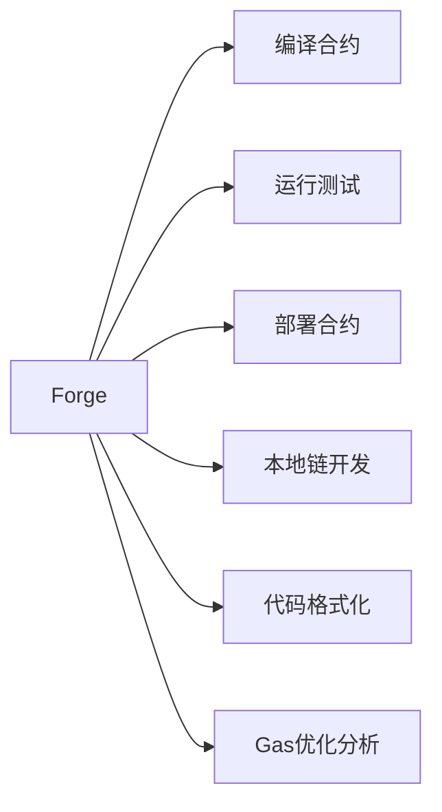
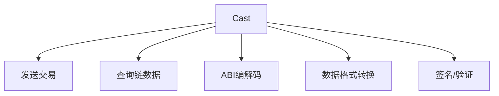
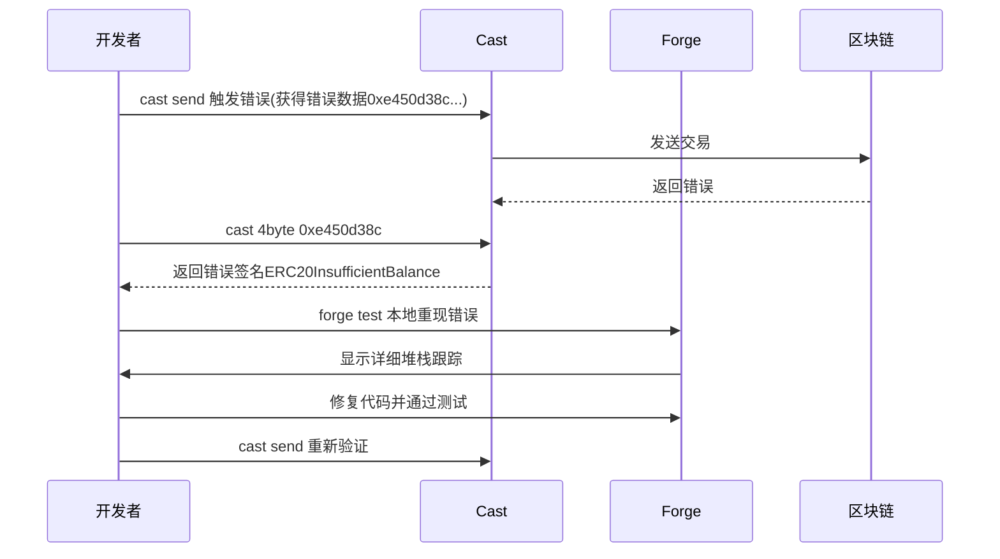

`forge` 和 `cast` 是 Ethereum 开发工具套件 **Foundry** 中的两个核心组件，它们分工明确但紧密协作。以下是详细解释：

---

### 1. `forge` - 智能合约开发框架
**定位**：智能合约的全生命周期管理工具  
**核心功能**：


**典型工作流**：
```bash
forge init my_project     # 初始化项目
forge build               # 编译合约
forge test                # 运行测试（支持模糊测试）
forge script Deploy       # 部署脚本执行
forge fmt                 # 代码格式化
```

---

### 2. `cast` - 以太坊交互瑞士军刀
**定位**：区块链操作的命令行接口  
**核心能力**：


**常用场景**：
```bash
cast send <合约> "函数" 参数    # 发送交易
cast call <合约> "视图函数"      # 查询状态
cast block latest              # 获取最新区块
cast --to-base 0x1 hex         # 数据格式转换
cast sig "transfer(address)"   # 计算函数选择器
```

---

### 3. 两者关系：互补协作
| 维度         | `forge`                            | `cast`                             |
|--------------|------------------------------------|------------------------------------|
| **核心目标** | 合约开发与测试                     | 链上交互与调试                     |
| **使用场景** | 开发环境                           | 生产环境/测试网                   |
| **数据流向** | 生成合约ABI/字节码 →              | 使用ABI与链交互 ←                 |
| **典型协作** | 用`forge`部署 → 用`cast`调用       | 用`cast`发现错误 → 用`forge`修复   |

---

### 4. 协同工作示例
**场景**：调试合约错误


---

### 5. 设计哲学差异
| 工具  | 设计思想                          | 类比工具              |
|-------|----------------------------------|----------------------|
| forge | "Make development easy"          | Hardhat + Truffle    |
| cast  | "Make chain interaction simple"  | web3.js CLI + curl   |

---

### 6. 何时使用哪个？
- 用 `forge` 当您需要：
  - 编写/测试合约逻辑
  - 管理项目依赖
  - 执行自动化部署脚本
  - 进行Gas优化分析
  
- 用 `cast` 当您需要：
  - 与已部署合约交互
  - 实时查询链上状态
  - 解码交易数据/错误
  - 快速验证合约行为

两者共同构成了 Foundry 的完整开发生态，覆盖从编码到生产交互的全流程。