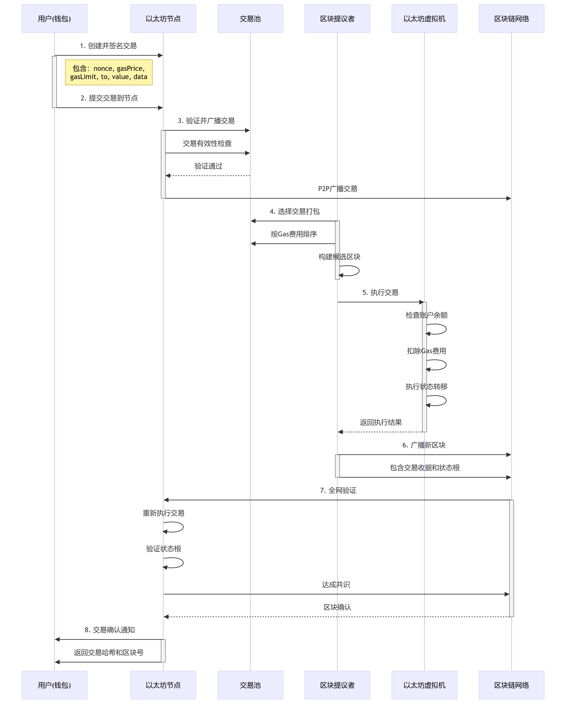

## Solidity 中，`memory`、`storage`、`calldata` 和 `indexed`详解

在 Solidity 中，`memory`、`storage`、`calldata` 和 `indexed` 是关键概念，分别涉及数据存储位置和事件日志优化。以下是详细解释：

---

### 1. **`memory`**
- **作用**：声明**临时变量**，仅在函数执行期间存在（类似 RAM）。
- **特点**：
  - 数据在函数调用结束后被清除。
  - 用于处理函数内的**引用类型**（如数组、结构体、字符串）。
  - 可读写。
- **Gas 成本**：读写操作相对便宜（但大数组可能昂贵）。
- **示例**：
  ```solidity
  function process(uint[] memory input) public pure returns (uint) {
      uint[] memory temp = new uint[](input.length); // 临时数组
      temp[0] = input[0]; // 可修改
      return temp[0];
  }
  ```

---

### 2. **`storage`**
- **作用**：指向**合约状态变量**的永久存储（类似硬盘）。
- **特点**：
  - 数据存储在区块链上，永久存在。
  - 用于修改合约的状态变量。
  - 可读写。
- **Gas 成本**：读写操作昂贵（尤其是写入）。
- **示例**：
  ```solidity
  contract Example {
      uint[] public data; // 状态变量（默认在 storage）

      function updateStorage() public {
          uint[] storage ref = data; // 指向 storage 的引用
          ref.push(10); // 直接修改状态变量
      }
  }
  ```

---

### 3. **`calldata`**
- **作用**：**只读**的临时数据位置，用于存储**函数参数**。
- **特点**：
  - 仅适用于**外部函数**（`external`）的参数。
  - 数据来自交易调用（`msg.data`），不可修改。
  - 最省 Gas 的选择（避免复制数据）。
- **示例**：
  ```solidity
  function readOnly(uint[] calldata arr) external pure returns (uint) {
      return arr[0]; // 只能读取，不能修改
  }
  ```

---

### 4. **`indexed`**
- **作用**：标记**事件参数**，使其可被索引（用于日志过滤）。
- **特点**：
  - 一个事件最多 3 个 `indexed` 参数。
  - 索引参数存入日志的 `topics`（而非 `data`），便于链下检索。
  - 适合过滤地址、标识符等简单类型（复杂类型会哈希）。
- **示例**：
  ```solidity
  event Transfer(
      address indexed from,    // 可索引（前端可过滤）
      address indexed to,      // 可索引
      uint value               // 非索引（存储在 data 中）
  );

  // 前端过滤（如 ethers.js）：
  contract.on("Transfer", (from, to, value) => { ... });
  contract.queryFilter("Transfer", { from: someAddress }); // 按 from 过滤
  ```

---

### 关键对比
| 特性          | `memory`         | `storage`       | `calldata`      | `indexed`（事件专用） |
|---------------|------------------|-----------------|-----------------|----------------------|
| **生命周期**  | 函数执行期间     | 永久（链上存储）| 函数执行期间    | 事件日志存储         |
| **读写权限**  | 读写             | 读写            | **只读**        | 只读（日志）         |
| **适用场景**  | 函数内部临时变量 | 状态变量        | 外部函数参数    | 事件参数             |
| **Gas 成本**  | 中等             | 高（尤其写入）  | **最低**        | 增加日志 Gas 成本    |
| **修改影响**  | 不影响状态       | 修改合约状态    | 无影响          | 无直接影响           |

---

### 最佳实践
1. **优先用 `calldata`**：  
   外部函数的参数（如数组）使用 `calldata` 节省 Gas。
2. **避免 `storage` 复制**：  
   直接操作状态变量时，用 `storage` 引用减少复制开销。
3. **`indexed` 用于高频过滤字段**：  
   如地址、交易 ID 等需快速检索的参数。

通过合理使用这些关键字，可显著优化合约的 Gas 效率和可维护性。

## 转账eth的完整流程



## solidity中的Gas优化方案

### 1. **变量声明优化**

#### 变量打包（Packing）
```solidity
// ❌ 浪费Gas：每个变量占用32字节
contract Bad {
    uint256 a; // 32 bytes
    uint256 b; // 32 bytes  
    uint256 c; // 32 bytes
}

// ✅ 节省Gas：打包到同一槽位
contract Good {
    uint128 a; // 16 bytes
    uint128 b; // 16 bytes
    uint256 c; // 32 bytes
}
```
**Gas节省**：每个槽位节省约20,000 gas（存储操作）

#### 变量类型选择
```solidity
// ❌ 浪费Gas
uint256 small = 1; // 32字节，浪费31字节

// ✅ 节省Gas
uint8 small = 1;   // 1字节，节省31字节
```
**Gas节省**：每个变量节省约5,000-15,000 gas

### 2. **循环优化**

#### 循环边界优化
```solidity
// ❌ 浪费Gas：每次循环都读取数组长度
for (uint i = 0; i < array.length; i++) {
    // 操作
}

// ✅ 节省Gas：缓存数组长度
uint length = array.length;
for (uint i = 0; i < length; i++) {
    // 操作
}
```
**Gas节省**：每次循环节省约100 gas

#### 循环展开
```solidity
// ❌ 标准循环
for (uint i = 0; i < 4; i++) {
    array[i] = i;
}

// ✅ 循环展开（适用于小循环）
array[0] = 0;
array[1] = 1;
array[2] = 2;
array[3] = 3;
```
**Gas节省**：小循环可节省约500-1,000 gas

### 3. **函数优化**

#### 函数可见性
```solidity
// ❌ 浪费Gas：public函数自动生成getter
uint256 public data;

// ✅ 节省Gas：明确指定可见性
uint256 private data;
```
**Gas节省**：每个public变量节省约2,000 gas

#### 函数参数优化
```solidity
// ❌ 浪费Gas：使用storage引用
function badFunction(uint[] storage arr) internal {
    uint[] storage temp = arr;
}

// ✅ 节省Gas：使用calldata
function goodFunction(uint[] calldata arr) external pure {
    // 直接使用arr，无需复制
}
```
**Gas节省**：使用calldata可节省约5,000-20,000 gas

### 4. **存储操作优化**

#### 批量操作
```solidity
// ❌ 浪费Gas：多次存储操作
function badBatch() external {
    data[0] = 1; // 20,000 gas
    data[1] = 2; // 20,000 gas
    data[2] = 3; // 20,000 gas
}

// ✅ 节省Gas：使用结构体批量存储
struct BatchData {
    uint256 a;
    uint256 b;
    uint256 c;
}
function goodBatch() external {
    BatchData memory batch = BatchData(1, 2, 3);
    // 一次性存储，节省gas
}
```
**Gas节省**：批量操作可节省约10,000-30,000 gas

#### 存储位置选择
```solidity
// ❌ 浪费Gas：频繁修改storage
uint256[] public storageArray;

// ✅ 节省Gas：使用memory处理后再存储
function processArray() external {
    uint256[] memory tempArray = new uint256[](100);
    // 在memory中处理
    // 最后一次性存储到storage
}
```
**Gas节省**：memory操作比storage便宜约15,000-25,000 gas

### 5. **事件优化**

#### 事件参数优化
```solidity
// ❌ 浪费Gas：过多indexed参数
event BadEvent(
    address indexed from,
    address indexed to,
    uint256 indexed value, // 第三个indexed参数
    string message
);

// ✅ 节省Gas：合理使用indexed
event GoodEvent(
    address indexed from,
    address indexed to,
    uint256 value,        // 非indexed，节省gas
    string message
);
```
**Gas节省**：减少indexed参数可节省约375 gas

### 6. **Gas成本对比表**

| 操作类型 | Gas成本 | 优化建议 |
|---------|---------|----------|
| **存储写入** | 20,000 gas | 批量操作，减少存储次数 |
| **存储读取** | 2,100 gas | 缓存变量，避免重复读取 |
| **内存分配** | 3 gas/字节 | 使用calldata，减少内存复制 |
| **函数调用** | 2,100 gas | 内联小函数，减少调用开销 |
| **循环迭代** | 100-500 gas/次 | 循环展开，缓存边界值 |
| **事件日志** | 375 gas + 数据gas | 减少indexed参数，优化数据结构 |

### 7. **实际优化示例**

```solidity
// ❌ 未优化的合约
contract Unoptimized {
    uint256 public value1;
    uint256 public value2;
    uint256 public value3;
    
    function setValues(uint256 a, uint256 b, uint256 c) external {
        value1 = a;
        value2 = b;
        value3 = c;
    }
    
    function processArray(uint256[] storage arr) external {
        for (uint i = 0; i < arr.length; i++) {
            arr[i] = arr[i] * 2;
        }
    }
}

// ✅ 优化后的合约
contract Optimized {
    // 变量打包
    uint128 public value1;
    uint128 public value2;
    uint256 public value3;
    
    // 批量设置，减少存储操作
    function setValues(uint128 a, uint128 b, uint256 c) external {
        value1 = a;
        value2 = b;
        value3 = c;
    }
    
    // 缓存数组长度，使用memory处理
    function processArray(uint256[] calldata arr) external pure returns (uint256[] memory) {
        uint256[] memory result = new uint256[](arr.length);
        uint256 length = arr.length;
        
        for (uint i = 0; i < length; i++) {
            result[i] = arr[i] * 2;
        }
        return result;
    }
}
```

**总Gas节省**：优化后的合约可节省约40,000-80,000 gas（取决于操作复杂度）

### 8. **最佳实践总结**

1. **变量声明**：合理打包，选择合适类型
2. **循环优化**：缓存边界值，考虑循环展开
3. **函数设计**：减少storage操作，使用calldata
4. **存储策略**：批量操作，减少存储次数
5. **事件优化**：合理使用indexed参数
6. **代码审查**：定期检查gas使用情况

通过这些优化，可以将合约的gas消耗降低20-40%，显著提升用户体验和成本效益。

---

## Gas费用与ETH换算关系

### 1. **基本换算公式**

```
交易费用 = Gas使用量 × Gas价格
```

其中：
- **Gas使用量**：合约执行所需的计算资源（固定值）
- **Gas价格**：用户愿意为每个Gas单位支付的ETH数量（可调整）

### 2. **Gas价格单位换算**

#### Wei（最小单位）
```solidity
1 ETH = 10^18 Wei
1 Gwei = 10^9 Wei
1 ETH = 10^9 Gwei
```

#### 常用Gas价格范围
| 网络拥堵程度 | Gas价格范围 | 说明 |
|-------------|-------------|------|
| **低拥堵** | 5-20 Gwei | 交易确认时间：1-2分钟 |
| **中等拥堵** | 20-50 Gwei | 交易确认时间：2-5分钟 |
| **高拥堵** | 50-100+ Gwei | 交易确认时间：5-15分钟 |
| **极端拥堵** | 100-500+ Gwei | 交易确认时间：15分钟以上 |

### 3. **实际费用计算示例**

#### 简单转账交易
```solidity
// 标准ETH转账：21,000 gas
Gas使用量 = 21,000 gas
Gas价格 = 20 Gwei = 20 × 10^-9 ETH

交易费用 = 21,000 × (20 × 10^-9) = 0.00042 ETH
// 约等于 $0.84（假设ETH = $2,000）
```

#### 智能合约交互
```solidity
// 存储写入操作：20,000 gas
Gas使用量 = 20,000 gas
Gas价格 = 30 Gwei = 30 × 10^-9 ETH

交易费用 = 20,000 × (30 × 10^-9) = 0.0006 ETH
// 约等于 $1.20（假设ETH = $2,000）
```

#### 复杂合约操作
```solidity
// 批量操作：100,000 gas
Gas使用量 = 100,000 gas
Gas价格 = 25 Gwei = 25 × 10^-9 ETH

交易费用 = 100,000 × (25 × 10^-9) = 0.0025 ETH
// 约等于 $5.00（假设ETH = $2,000）
```

### 4. **Gas价格动态调整机制**

#### EIP-1559费用模型
```solidity
// 新费用结构
总费用 = 基础费用 + 优先费用

其中：
- 基础费用：被销毁，动态调整
- 优先费用：给矿工的小费
```

#### 基础费用计算
```solidity
// 基础费用根据区块使用率动态调整
if (区块使用率 > 50%) {
    基础费用 += 12.5%
} else if (区块使用率 < 50%) {
    基础费用 -= 12.5%
}
```

### 5. **不同网络Gas价格对比**

| 网络 | 平均Gas价格 | 特点 |
|------|-------------|------|
| **以太坊主网** | 15-50 Gwei | 安全性最高，费用较高 |
| **Polygon** | 0.1-1 Gwei | 费用极低，确认快速 |
| **BSC** | 3-10 Gwei | 费用适中，兼容性好 |
| **Arbitrum** | 0.1-0.5 Gwei | 费用低，L2解决方案 |

### 6. **Gas费用优化策略**

#### 时间选择
```solidity
// 选择低峰期执行交易
// 美国东部时间：凌晨2-6点
// 欧洲时间：凌晨3-7点
// 亚洲时间：下午2-6点
```

#### 价格设置策略
```solidity
// 1. 设置Gas价格上限
maxFeePerGas: 50 Gwei
maxPriorityFeePerGas: 2 Gwei

// 2. 使用动态Gas价格
// 根据网络拥堵程度自动调整
```

### 7. **实际开发中的费用估算**

#### 使用Hardhat估算
```javascript
// 估算Gas使用量
const gasEstimate = await contract.estimateGas.functionName(params);
console.log(`预估Gas: ${gasEstimate.toString()}`);

// 估算费用
const gasPrice = await ethers.provider.getGasPrice();
const fee = gasEstimate.mul(gasPrice);
console.log(`预估费用: ${ethers.utils.formatEther(fee)} ETH`);
```

#### 使用Web3.js估算
```javascript
// 估算Gas
const gasEstimate = await contract.methods.functionName(params).estimateGas();
console.log(`预估Gas: ${gasEstimate}`);

// 获取当前Gas价格
const gasPrice = await web3.eth.getGasPrice();
const fee = gasEstimate * gasPrice;
console.log(`预估费用: ${web3.utils.fromWei(fee, 'ether')} ETH`);
```

### 8. **费用监控工具**

#### 实时监控网站
- **Etherscan Gas Tracker**：实时Gas价格
- **GasNow**：Gas价格预测
- **ETH Gas Station**：详细费用分析

#### 开发工具集成
```javascript
// 在DApp中集成Gas价格显示
async function getGasPrice() {
    const gasPrice = await provider.getGasPrice();
    const gwei = ethers.utils.formatUnits(gasPrice, 'gwei');
    return `${gwei} Gwei`;
}
```

### 9. **总结**

1. **Gas费用 = Gas使用量 × Gas价格**
2. **1 ETH = 10^9 Gwei = 10^18 Wei**
3. **标准转账：21,000 gas × 20 Gwei = 0.00042 ETH**
4. **合约交互：20,000-100,000+ gas，费用因操作复杂度而异**
5. **选择合适时机和Gas价格可显著降低交易成本**
6. **使用工具监控和估算Gas费用，优化用户体验**

通过理解Gas费用与ETH的换算关系，开发者可以更好地优化智能合约，为用户提供成本效益更高的DApp体验。